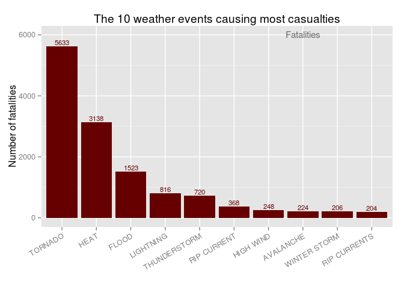
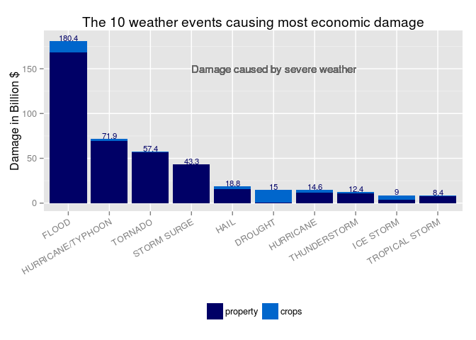

# Impact of severe weather events on health and economy
Remco Niggebrugge  
01/19/2015  

Based on the information from the U.S. National Oceanic and Atmoshperic Administration (NOAA) our research will show which are the severe weather type having the biggest impact on the health of the population and on the economy of the country. The number of weather related casualties and injuries is used to assess the impact on health. Damages to properties and crops (argicultar sector) is used to assess the impact on the economy. The report will list the most damaging weather types.

<br>

###1. R Libraries

For the proper functioning of the code used in this report, the following libraries are required:


```r
library(tidyr)
library(ggplot2)
library(lubridate)
library(grid)
library(dplyr)
```

```
## 
## Attaching package: 'dplyr'
## 
## The following objects are masked from 'package:lubridate':
## 
##     intersect, setdiff, union
## 
## The following object is masked from 'package:stats':
## 
##     filter
## 
## The following objects are masked from 'package:base':
## 
##     intersect, setdiff, setequal, union
```

<br>

###2. Data Processing

The **Storm Data** file is first loaded into [R] for further processing:


```r
x <- read.csv("./repdata-data-StormData.csv.bz2", stringsAsFactors = FALSE)
```

The result is an extensive dataset with information from 1950 till 2011. 

Only the values related to casualties, injuries, property damage, crops damage and event type are relevant for this research.  


```r
c <-c("EVTYPE","FATALITIES","INJURIES","PROPDMG","PROPDMGEXP","CROPDMG","CROPDMGEXP")
n <- c("type","fat","inj","prop","prope","crop","crope")
x <- x[,c]
names(x) <- n
```
 
After selecting and renaming columns, the resulting data.frame has the following columns:

* type (weather type)
* fat (# fatalities)
* inj (# injuries)
* prop (# property damage)
* crop (# crops damage)
* prope (multiplication factor property damage)
* crope (multiplication factor crops damage)

<br>

####2.1. Impact on health

For the impact on health the relevant data are in the columns *fat* and *inj*, for later processing these two values are summarized (summed) for the event types *type*.


```r
g             <- group_by(x, type)
health        <- summarize(g, fat = sum(fat), inj = sum(inj))
```

An inspection of the registered categories shows there are many similar types. In an attempt to correct for this, some similar categories are combined in the following way:

* all types containing the word *THUNDERSTORM* or beginning with the *TSTM*: <u>combined category THUNDERSTORM</u>;
* containing *FLOOD*: <u>combined category FLOOD</u>;
* containing *HEAT*: <u>combined category HEAT</u>;
* containing *DRY*: <u>combined category DRY</u>;
* all other categories will not change name


```r
health[grep("THUNDERSTORM", health$type),]$type <- "THUNDERSTORM"
health[grep("FLOOD", health$type),]$type <- "FLOOD"
health[grep("HEAT", health$type),]$type <- "HEAT"
health[grep("^TSTM", health$type),]$type <- "THUNDERSTORM"
health[grep("DRY", health$type),]$type <- "DRY"
```

With the updated *type* a new summarization needs to be done. The recategorization has been carried out after the first summarization in order to reduce processing time. 


```r
g      <- group_by(health, type)
health <- summarize(g, fat = sum(fat), inj = sum(inj))
```

Now lists containing the most damaging weather types can be created.


```r
topF <- arrange(top_n(health, 10, fat), desc(fat))
topI <- arrange(top_n(health, 10, inj), desc(inj))

# creating an ordered factor for plots

topF$type <- factor(topF$type, levels = topF$type, ordered=TRUE)
topI$type <- factor(topI$type, levels = topI$type, ordered=TRUE)
```

<br>

####2.2. Impact on the economy

For the economic impact two values are relevant in this dataset, *prop* and *crop* that represent damage to property and damage to crops. Both columns have to be multiplied by *prope* and *crope* respectively, these represent the order of magnitude. Before making the calculation we need to tidy these two last columns.


```r
x$prope[x$prope=="" | x$prope=="?" | x$prope=="-" | x$prope=="+"] <- "0"
x$prope[x$prope=="h" | x$prope=="H"] <- "2"
x$prope[x$prope=="k" | x$prope=="K"] <- "3"
x$prope[x$prope=="m" | x$prope=="M"] <- "6"
x$prope[x$prope=="b" | x$prope=="B"] <- "9"

x$crope[x$crope=="" | x$crope=="?" | x$crope=="-" | x$crope=="+"] <- "0"
x$crope[x$crope=="h" | x$crope=="H"] <- "2"
x$crope[x$crope=="k" | x$crope=="K"] <- "3"
x$crope[x$crope=="m" | x$crope=="M"] <- "6"
x$crope[x$crope=="b" | x$crope=="B"] <- "9"

x$prope <- as.numeric(x$prope)
x$crope <- as.numeric(x$crope)

x$propdmg <- x$prop*10^x$prope
x$cropdmg <- x$crop*10^x$crope

x$dmg <- x$cropdmg + x$propdmg
```

Now with the properly calculated damages a summary can be made. As with health impact the grouping will be over the severe weather types. Also the same recategorization will be carried out, grouping similar categories.


```r
g      <- group_by(x, type)
damage <- summarize(g, total=sum(dmg), prop=sum(propdmg), crop=sum(cropdmg))

damage[grep("THUNDERSTORM", damage$type),]$type <- "THUNDERSTORM"
damage[grep("FLOOD", damage$type),]$type <- "FLOOD"
damage[grep("HEAT", damage$type),]$type <- "HEAT"
damage[grep("^TSTM", damage$type),]$type <- "THUNDERSTORM"
damage[grep("DRY", damage$type),]$type <- "DRY"

g      <- group_by(damage, type)
damage <- summarize(g, total=sum(total), property=sum(prop), crops=sum(crop))
damage <- arrange(top_n(damage, 10, total), desc(total))

# creating an ordered factor for plots
damage$type  <- factor(damage$type,  levels = damage$type,  ordered=TRUE)

# express values in billions for better readability
damage$total <- round(damage$total*1e-9, digits=1)
damage$crops  <- round(damage$crops*1e-9,  digits=1)
damage$property  <- round(damage$property*1e-9,  digits=1)

# melt table for better plotting
melted <- damage[,c("type", "property", "crops")]
melted <- gather(melted, var, val, -type)
names(melted) <- c("type", "damage", "value")
```

<br>

####2.3. Creating plots

To improve readability of the report, all plots are generated in this processing section. The actual results are incorporated in the **Results** section.


```r
## Plot top 10 weather events causing fatalities

g1 <- ggplot(topF, aes(x=factor(type), y=fat))
g1 <- g1 + geom_bar(stat="identity", fill="#660000")
g1 <- g1 + theme(axis.text.x = element_text(angle = 30, hjust = 1))
g1 <- g1 + xlab("") + ylab("Number of fatalities")
g1 <- g1 + geom_text(aes(label=fat),vjust=-0.25, size=3, colour="#660000")
g1 <- g1 + geom_text(data=data.frame(),
                     aes(8,6000,label="Fatalities"), colour="#666666", size=4)
g1 <- g1 + ggtitle("The 10 weather events causing most casualties")

## Plot top 10 weather events causing injuries

g2 <- ggplot(topI, aes(x=factor(type), y=inj))
g2 <- g2 + geom_bar(stat="identity", fill="#003366")
g2 <- g2 + xlab("") + ylab("Number of injuries")
g2 <- g2 + theme(axis.text.x = element_text(angle = 30, hjust =1))
g2 <- g2 + geom_text(aes(label=inj),vjust=-0.25, size=3, colour="#003366")
g2 <- g2 + geom_text(data=data.frame(),
                     aes(8,80000,label="Injuries"), size=4, colour="#666666")
g2 <- g2 + ggtitle("The 10 weather events causing most injuries")

## Plot top 10 weather events causing economic damages

g3 <- ggplot(melted, aes(x=factor(type), y=value, fill=damage)) +
        geom_bar(stat="identity") + 
        scale_fill_manual(values=c("#000066","#0066cc")) + 
        geom_text(data=data.frame(), 
                  aes(6,150,
                  label="Damage caused by severe weather"), 
                  colour="#666666", size=4) +
        xlab("") + ylab("Damage in Billion $") +
        theme(axis.text.x = element_text(angle = 30, hjust = 1)) + 
        theme(legend.title=element_blank(), legend.position = "bottom")
g3 <- g3 + annotate("text", x = factor(damage$type), color="#000066",
                    y = damage$total+3.3, label = damage$total, size=3) 
g3 <- g3 + ggtitle("The 10 weather events causing most economic damage")        
```

<br>

###3. Results


####3.1. Weather events having most impact on health

Using the processing in the previous section the following graph can be created, indicating those severe weather events having the worst impact on health.


```r
g1; g2
```

  

As can be concluded from above plots by far the most devastating weather event is the **tornado**. Between 1950 and 2011 Tornados caused 5633 casualties and 91346 injuries. 

Other weather types having big impact are **heat**, **thunderstorms** and **flood**. It is difficult to rank injuries against casualties, therefore no attempt is made to combine these numbers into one indicator.

<br>

####3.2. Weather events having large impact on the economy

With the damages calculated in the "Processing" section, it is possible to plot the total damages against severe weather type. The total economic damage is the sum of the damages to properties and to crops (agricultaral industry). 


```r
g3
```

 

**Flood** and **wind related weather phenomena** (hurricanes, tornados, storm surges, etc.) have the biggest impact on the economy. As can be seen from the graph, **drought** has the biggest impact on crops, but as it has minor impact on properties it ranks only 6th overall. 

<br>

  
  
